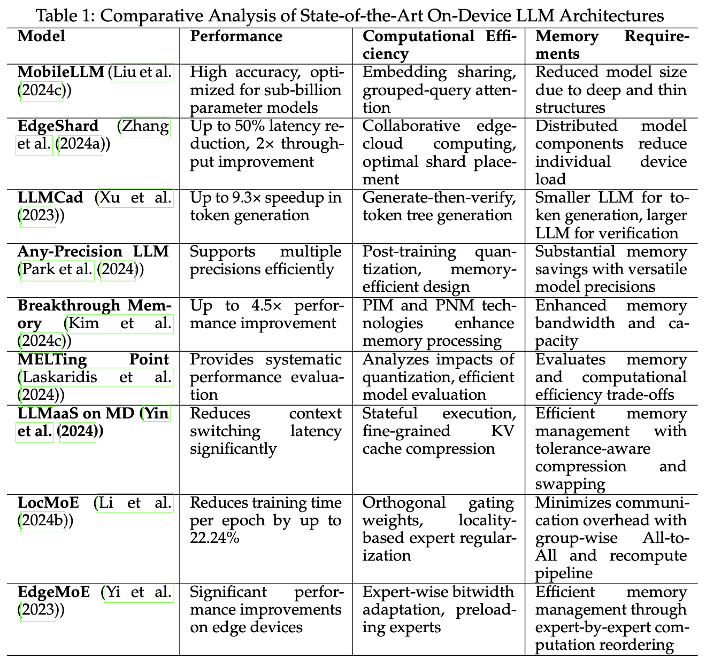

# Awesome LLMs on Device: A Comprehensive Survey

<<<<<<< HEAD

# Contents
- [Awesome LLMs on Device: A Comprehensive Survey](#awesome-llms-on-device-a-comprehensive-survey)
- [Contents](#contents)
  - [Foundations and Preliminaries](#foundations-and-preliminaries)
    - [Evolution of On-Device LLMs](#evolution-of-on-device-llms)
    - [LLM Architecture Foundations](#llm-architecture-foundations)
    - [On-Device LLMs Training](#on-device-llms-training)
    - [Limitations of Cloud-Based LLM Inference and Advantages of On-Device Inference](#limitations-of-cloud-based-llm-inference-and-advantages-of-on-device-inference)
    - [The Performance Indicator of On-Device LLMs](#the-performance-indicator-of-on-device-llms)
  - [Efficient Architectures for On-Device LLMs](#efficient-architectures-for-on-device-llms)
    - [Model Compression and Parameter Sharing](#model-compression-and-parameter-sharing)
    - [Collaborative and Hierarchical Model Approaches](#collaborative-and-hierarchical-model-approaches)
    - [Memory and Computational Efficiency](#memory-and-computational-efficiency)
    - [Mixture-of-Experts (MoE) Architectures](#mixture-of-experts-moe-architectures)
    - [General Efficiency and Performance Improvements](#general-efficiency-and-performance-improvements)
  - [Model Compression and Optimization Techniques for On-Device LLMs](#model-compression-and-optimization-techniques-for-on-device-llms)
    - [Quantization](#quantization)
    - [Pruning](#pruning)
    - [Knowledge Distillation](#knowledge-distillation)
    - [Low-Rank Factorization](#low-rank-factorization)
  - [Hardware Acceleration and Deployment Strategies](#hardware-acceleration-and-deployment-strategies)
    - [Popular On-Device LLMs Framework](#popular-on-device-llms-framework)
    - [Hardware Acceleration](#hardware-acceleration)
- [Tutorial:](#tutorial)
=======

  
  
Summary of On-device LLMs’ Evolution

This repository contains resources and information related to our comprehensive survey paper on Large Language Models (LLMs) deployed on edge devices.

# Abstract

The advent of large language models (LLMs) has revolutionized natural language processing applications, and running LLMs on edge devices has become increasingly attractive for reasons including reduced latency, data localization, and personalized user experiences. This comprehensive review examines the challenges of deploying computationally expensive LLMs on resource-constrained devices and explores innovative solutions across multiple domains. We investigate the development of on-device LLMs, their efficient architectures, including parameter sharing and modular designs, as well as state-of-the-art compression techniques like quantization, pruning, and knowledge distillation. Hardware acceleration strategies and collaborative edge-cloud deployment approaches are analyzed, highlighting the intricate balance between performance and resource utilization. Case studies of on-device LLMs from major mobile manufacturers demonstrate real-world applications and potential benefits. The review also addresses critical aspects such as adaptive learning, multi-modal capabilities, and personalization. By identifying key research directions and open challenges, this paper provides a roadmap for future advancements in on-device LLMs, emphasizing the need for interdisciplinary efforts to realize the full potential of ubiquitous, intelligent computing while ensuring responsible and ethical deployment.

# Key Features

- Comprehensive review of on-device LLM technologies
- Analysis of efficient architectures and compression techniques
- Exploration of hardware acceleration strategies
- Case studies of real-world applications
- Discussion of future research directions and challenges

# Table of Contents

Here's a suggested organization of the references into sections based on the paper architecture:

- [Foundations and Preliminaries](#foundations-and-preliminaries)
  - [Evolution of On-Device LLMs](#evolution-of-on-device-llms)
  - [LLM Architecture Foundations](#llm-architecture-foundations)
  - [On-Device LLMs Training](#on-device-llms-training)
  - [Limitations of Cloud-Based LLM Inference and Advantages of On-Device Inference](#limitations-of-cloud-based-llm-inference-and-advantages-of-on-device-inference)
  - [The Performance Indicator of On-Device LLMs](#the-performance-indicator-of-on-device-llms)
- [Efficient Architectures for On-Device LLMs](#efficient-architectures-for-on-device-llms)
  - [Model Compression and Parameter Sharing](#model-compression-and-parameter-sharing)
  - [Collaborative and Hierarchical Model Approaches](#collaborative-and-hierarchical-model-approaches)
  - [Memory and Computational Efficiency](#memory-and-computational-efficiency)
  - [Mixture-of-Experts (MoE) Architectures](#mixture-of-experts-moe-architectures)
  - [General Efficiency and Performance Improvements](#general-efficiency-and-performance-improvements)
- [Model Compression and Optimization Techniques for On-Device LLMs](#model-compression-and-optimization-techniques-for-on-device-llms)
  - [Quantization](#quantization)
  - [Pruning](#pruning)
  - [Knowledge Distillation](#knowledge-distillation)
  - [Low-Rank Factorization](#low-rank-factorization)
- [Hardware Acceleration and Deployment Strategies](#hardware-acceleration-and-deployment-strategies)
  - [Popular On-Device LLMs Framework](#popular-on-device-llms-framework)
  - [Hardware Acceleration](#hardware-acceleration)
- [Model Reference](#model-reference)
- [Tutorial](#tutorial)
>>>>>>> origin
- [Citation](#citation)

## Foundations and Preliminaries

### Evolution of On-Device LLMs

- Tinyllama: An open-source small language model   arXiv 2024 [[Paper]](https://arxiv.org/abs/2401.02385) [[Github]](https://github.com/jzhang38/TinyLlama)
- MobileVLM V2: Faster and Stronger Baseline for Vision Language Model   arXiv 2024 [[Paper]](https://arxiv.org/abs/2402.03766) [[Github]](https://github.com/Meituan-AutoML/MobileVLM)
- MobileAIBench: Benchmarking LLMs and LMMs for On-Device Use Cases   arXiv 2024 [[Paper]](https://arxiv.org/abs/2406.10290)
- Octopus series papers   arXiv 2024 [[Octopus]](https://arxiv.org/abs/2404.01549) [[Octopus v2]](https://arxiv.org/abs/2404.01744) [[Octopus v3]](https://arxiv.org/abs/2404.11459) [[Octopus v4]](https://arxiv.org/abs/2404.19296) [[Github]](https://github.com/NexaAI)
- The Era of 1-bit LLMs: All Large Language Models are in 1.58 Bits   arXiv 2024 [[Paper]](https://arxiv.org/abs/2402.17764)
- AWQ: Activation-aware Weight Quantization for LLM Compression and Acceleration   arXiv 2023 [[Paper]](https://arxiv.org/abs/2306.00978) [[Github]](https://github.com/mit-han-lab/llm-awq)

### LLM Architecture Foundations

- The case for 4-bit precision: k-bit inference scaling laws   ICML 2023 [[Paper]](https://arxiv.org/abs/2212.09720)
- Challenges and applications of large language models   arXiv 2023 [[Paper]](https://arxiv.org/abs/2307.10169)
- MiniLLM: Knowledge distillation of large language models   ICLR 2023 [[Paper]](https://arxiv.org/abs/2306.08543) [[github]](https://github.com/Tebmer/Awesome-Knowledge-Distillation-of-LLMs)
- Gptq: Accurate post-training quantization for generative pre-trained transformers   ICLR 2023 [[Paper]](https://arxiv.org/abs/2210.17323) [[Github]](https://github.com/IST-DASLab/gptq)
- Gpt3. int8 (): 8-bit matrix multiplication for transformers at scale   NeurIPS 2022 [[Paper]](https://arxiv.org/abs/2208.07339)

### On-Device LLMs Training

- OpenELM: An Efficient Language Model Family with Open Training and Inference Framework   ICML 2024 [[Paper]](https://arxiv.org/abs/2404.14619) [[Github]](https://github.com/apple/corenet)

### Limitations of Cloud-Based LLM Inference and Advantages of On-Device Inference

- Ferret-v2: An Improved Baseline for Referring and Grounding with Large Language Models   arXiv 2024 [[Paper]](https://arxiv.org/abs/2404.07973)
- Phi-3 Technical Report: A Highly Capable Language Model Locally on Your Phone   arXiv 2024 [[Paper]](https://arxiv.org/abs/2404.14219)
- Exploring post-training quantization in llms from comprehensive study to low rank compensation   AAAI 2024 [[Paper]](https://arxiv.org/abs/2303.08302)
- Matrix compression via randomized low rank and low precision factorization   NeurIPS 2023 [[Paper]](https://arxiv.org/abs/2310.11028) [[Github]](https://github.com/pilancilab/matrix-compressor)

### The Performance Indicator of On-Device LLMs

- MNN: A lightweight deep neural network inference engine   2024 [[Github]](https://github.com/alibaba/MNN)
- PowerInfer-2: Fast Large Language Model Inference on a Smartphone   arXiv 2024 [[Paper]](https://arxiv.org/abs/2406.06282) [[Github]](https://github.com/SJTU-IPADS/PowerInfer)
- llama.cpp: Lightweight library for Approximate Nearest Neighbors and Maximum Inner Product Search   2023 [[Github]](https://github.com/ggerganov/llama.cpp)
- Powerinfer: Fast large language model serving with a consumer-grade gpu   arXiv 2023 [[Paper]](https://arxiv.org/abs/2312.12456) [[Github]](https://github.com/SJTU-IPADS/PowerInfer)

## Efficient Architectures for On-Device LLMs

<<<<<<< HEAD
| Model                           | Performance                                         | Computational Efficiency                                                    | Memory Requirements                                               |
|---------------------------------|-----------------------------------------------------|----------------------------------------------------------------------------|-------------------------------------------------------------------|
| **MobileLLM (Liu et al. 2024c)** | High accuracy, optimized for sub-billion parameter models | Embedding sharing, grouped-query attention                                  | Reduced model size due to deep and thin structures                 |
| **EdgeShard (Zhang et al. 2024a)** | Up to 50% latency reduction, 2× throughput improvement | Collaborative edge-cloud computing, optimal shard placement                  | Distributed model components reduce individual device load         |
| **LLMCad (Xu et al. 2023)**      | Up to 9.3× speedup in token generation              | Generate-then-verify, token tree generation                                 | Smaller LLM for token generation, larger LLM for verification      |
| **Any-Precision LLM (Park et al. 2024)** | Supports multiple precisions efficiently            | Post-training quantization, memory-efficient design                         | Substantial memory savings with versatile model precisions         |
| **Breakthrough Memory (Kim et al. 2024c)** | Up to 4.5× performance improvement                  | PIM and PNM technologies enhance memory processing                          | Enhanced memory bandwidth and capacity                             |
| **MELTing Point (Laskaridis et al. 2024)** | Provides systematic performance evaluation          | Analyzes impacts of quantization, efficient model evaluation                | Evaluates memory and computational efficiency trade-offs           |
| **LLMaaS on MD (Yin et al. 2024)** | Reduces context switching latency significantly     | Stateful execution, fine-grained KV cache compression                       | Efficient memory management with tolerance-aware compression and swapping |
| **LocMoE (Li et al. 2024b)**     | Reduces training time per epoch by up to 22.24%     | Orthogonal gating weights, locality-based expert regularization             | Minimizes communication overhead with group-wise All-to-All and recompute pipeline |
| **EdgeMoE (Yi et al. 2023)**     | Significant performance improvements on edge devices | Expert-wise bitwidth adaptation, preloading experts                         | Efficient memory management through expert-by-expert computation reordering |

=======
### Comparison of On-Device LLM Architectures

The following table provides a comparative analysis of state-of-the-art on-device LLM architectures, focusing on their performance, computational efficiency, and memory requirements.

    

>>>>>>> origin

### Model Compression and Parameter Sharing

- AWQ: Activation-aware Weight Quantization for LLM Compression and Acceleration   arXiv 2024 [[Paper]](https://arxiv.org/abs/2306.00978) [[Github]](https://github.com/mit-han-lab/llm-awq)
- MobileLLM: Optimizing Sub-billion Parameter Language Models for On-Device Use Cases   arXiv 2024 [[Paper]](https://arxiv.org/abs/2402.14905) [[Github]](https://github.com/facebookresearch/MobileLLM)

### Collaborative and Hierarchical Model Approaches

- EdgeShard: Efficient LLM Inference via Collaborative Edge Computing   arXiv 2024 [[Paper]](https://arxiv.org/abs/2405.14371)
- Llmcad: Fast and scalable on-device large language model inference   arXiv 2023 [[Paper]](https://arxiv.org/abs/2309.04255)

### Memory and Computational Efficiency

- The Breakthrough Memory Solutions for Improved Performance on LLM Inference   IEEE Micro 2024 [[Paper]](https://ieeexplore.ieee.org/document/10477465)
- MELTing point: Mobile Evaluation of Language Transformers   arXiv 2024 [[Paper]](https://arxiv.org/abs/2403.12844) [[Github]](https://github.com/brave-experiments/MELT-public)

### Mixture-of-Experts (MoE) Architectures

- LLM as a system service on mobile devices   arXiv 2024 [[Paper]](https://arxiv.org/abs/2403.11805)
- Locmoe: A low-overhead moe for large language model training   arXiv 2024 [[Paper]](https://arxiv.org/abs/2401.13920)
- Edgemoe: Fast on-device inference of moe-based large language models   arXiv 2023 [[Paper]](https://arxiv.org/abs/2308.14352)

### General Efficiency and Performance Improvements

- Any-Precision LLM: Low-Cost Deployment of Multiple, Different-Sized LLMs   arXiv 2024 [[Paper]](https://www.arxiv.org/pdf/2402.10517) [[Github]](https://github.com/SNU-ARC/any-precision-llm)
- On the viability of using llms for sw/hw co-design: An example in designing cim dnn accelerators  IEEE SOCC 2023 [[Paper]](https://arxiv.org/abs/2306.06923)

## Model Compression and Optimization Techniques for On-Device LLMs

### Quantization

- The Era of 1-bit LLMs: All Large Language Models are in 1.58 Bits   arXiv 2024 [[Paper]](https://arxiv.org/abs/2402.17764)
- AWQ: Activation-aware Weight Quantization for LLM Compression and Acceleration   arXiv 2024 [[Paper]](https://arxiv.org/abs/2306.00978) [[Github]](https://github.com/mit-han-lab/llm-awq)
- Gptq: Accurate post-training quantization for generative pre-trained transformers   ICLR 2023 [[Paper]](https://arxiv.org/abs/2210.17323) [[Github]](https://github.com/IST-DASLab/gptq)
- Gpt3. int8 (): 8-bit matrix multiplication for transformers at scale   NeurIPS 2022 [[Paper]](https://arxiv.org/abs/2208.07339)

### Pruning

- Challenges and applications of large language models   arXiv 2023 [[Paper]](https://arxiv.org/abs/2307.10169)

### Knowledge Distillation

- MiniLLM: Knowledge distillation of large language models   ICLR 2024 [[Paper]](https://arxiv.org/abs/2306.08543)

### Low-Rank Factorization

- Exploring post-training quantization in llms from comprehensive study to low rank compensation   AAAI 2024 [[Paper]](https://arxiv.org/abs/2303.08302)
- Matrix compression via randomized low rank and low precision factorization   NeurIPS 2023 [[Paper]](https://arxiv.org/abs/2310.11028) [[Github]](https://github.com/pilancilab/matrix-compressor)

## Hardware Acceleration and Deployment Strategies

### Popular On-Device LLMs Framework

- llama.cpp: A lightweight library for efficient LLM inference on various hardware with minimal setup. [[Github]](https://github.com/ggerganov/llama.cpp)
- MNN: A blazing fast, lightweight deep learning framework. [[Github]](https://github.com/alibaba/MNN)
- PowerInfer: A CPU/GPU LLM inference engine leveraging activation locality for device. [[Github]](https://github.com/SJTU-IPADS/PowerInfer)
- ExecuTorch: A platform for On-device AI across mobile, embedded and edge for PyTorch. [[Github]](https://github.com/pytorch/executorch)
- MediaPipe: A suite of tools and libraries, enables quick application of AI and ML techniques. [[Github]](https://github.com/google-ai-edge/mediapipe)
- MLC-LLM: A machine learning compiler and high-performance deployment engine for large language models. [[Github]](https://github.com/mlc-ai/mlc-llm)
- VLLM: A fast and easy-to-use library for LLM inference and serving. [[Github]](https://github.com/vllm-project/vllm)
- OpenLLM: An open platform for operating large language models (LLMs) in production. [[Github]](https://python.langchain.com/v0.2/docs/integrations/llms/openllm/)

### Hardware Acceleration

- The Breakthrough Memory Solutions for Improved Performance on LLM Inference   IEEE Micro 2024 [[Paper]](https://ieeexplore.ieee.org/document/10477465)
- Aquabolt-XL: Samsung HBM2-PIM with in-memory processing for ML accelerators and beyond   IEEE Hot Chips 2021 [[Paper]](https://ieeexplore.ieee.org/abstract/document/9567191)

# Model Reference

|         Model         |      Institute      | Paper                                                                                                                                                                                                                                                                                                                                                                                                                 |
| :-------------------: | :-----------------: | --------------------------------------------------------------------------------------------------------------------------------------------------------------------------------------------------------------------------------------------------------------------------------------------------------------------------------------------------------------------------------------------------------------------- |
|      Gemini Nano      |       Google        | [Gemini: A Family of Highly Capable Multimodal Models](https://arxiv.org/pdf/2312.11805.pdf)                                                                                                                                                                                                                                                                                                                          |
| Octopus series model  |       Nexa AI       | [Octopus v2: On-device language model for super agent](https://arxiv.org/pdf/2404.01744.pdf) [Octopus v3: Technical Report for On-device Sub-billion Multimodal AI Agent](https://arxiv.org/pdf/2404.11459.pdf) [Octopus v4: Graph of language models](https://arxiv.org/pdf/2404.19296.pdf) [Octopus: On-device language model for function calling of software APIs](https://arxiv.org/pdf/2404.01549.pdf) |
| OpenELM and Ferret-v2 |        Apple        | OpenELM is a significant large language model integrated within iOS to enhance application functionalities.  Ferret-v2 significantly improves upon its predecessor, introducing enhanced visual processing capabilities and an advanced training regimen.                                                                                                                                                          |
|      Phi series       |      Microsoft      | [Phi-3 Technical Report: A Highly Capable Language Model Locally on Your Phone](https://arxiv.org/pdf/2404.14219.pdf)                                                                                                                                                                                                                                                                                                 |
|        MiniCPM        | Tsinghua University | [A GPT-4V Level Multimodal LLM on Your Phone](https://huggingface.co/openbmb/MiniCPM-Llama3-V-2_5)                                                                                                                                                                                                                                                                                                                    |
|       Gemma2-9B       |       Google        | [Gemma 2: Improving Open Language Models at a Practical Size](https://storage.googleapis.com/deepmind-media/gemma/gemma-2-report.pdf)                                                                                                                                                                                                                                                                                 |
|      Qwen2-0.5B       |    Alibaba Group    | [Qwen Technical Report](https://arxiv.org/pdf/2309.16609.pdf)                                                                                                                                                                                                                                                                                                                                                         |

# Tutorial:

- MIT: [TinyML and Efficient Deep Learning Computing](https://efficientml.ai)
- Harvard: [Machine Learning Systems](https://mlsysbook.ai/)

# Citation

If you find this survey helpful, please consider citing our paper:
