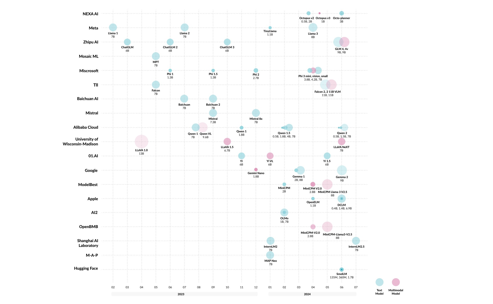

# 🚀 Awesome LLMs on Device: A Must-Read Comprehensive Hub by Nexa AI

[On-device Model Hub](https://model-hub.nexa4ai.com/) / [Nexa SDK Documentation](https://docs.nexaai.com/)

[release-url]: https://github.com/NexaAI/nexa-sdk/releases
[Windows-image]: https://img.shields.io/badge/windows-0078D4?logo=windows
[MacOS-image]: https://img.shields.io/badge/-MacOS-black?logo=apple
[Linux-image]: https://img.shields.io/badge/-Linux-333?logo=ubuntu

  
  
Summary of On-device LLMs’ Evolution

## 🌟 About This Hub
Welcome to the ultimate hub for on-device Large Language Models (LLMs)! This repository is your go-to resource for all things related to LLMs designed for on-device deployment. Whether you're a seasoned researcher, an innovative developer, or an enthusiastic learner, this comprehensive collection of cutting-edge knowledge is your gateway to understanding, leveraging, and contributing to the exciting world of on-device LLMs.

## 🚀 Why This Hub is a Must-Read
- 📊 Comprehensive overview of on-device LLM evolution with easy-to-understand visualizations
- 🧠 In-depth analysis of groundbreaking architectures and optimization techniques
- 📱 Curated list of state-of-the-art models and frameworks ready for on-device deployment
- 💡 Practical examples and case studies to inspire your next project
- 🔄 Regular updates to keep you at the forefront of rapid advancements in the field
- 🤝 Active community of researchers and practitioners sharing insights and experiences

  
# 📚 What's Inside Our Hub
- [Awesome LLMs on Device: A Comprehensive Survey](#-awesome-llms-on-device-a-must-read-comprehensive-hub)
- [Contents](-whats-inside-our-hub)
  - [Foundations and Preliminaries](#foundations-and-preliminaries)
    - [Evolution of On-Device LLMs](#evolution-of-on-device-llms)
    - [LLM Architecture Foundations](#llm-architecture-foundations)
    - [On-Device LLMs Training](#on-device-llms-training)
    - [Limitations of Cloud-Based LLM Inference and Advantages of On-Device Inference](#limitations-of-cloud-based-llm-inference-and-advantages-of-on-device-inference)
    - [The Performance Indicator of On-Device LLMs](#the-performance-indicator-of-on-device-llms)
  - [Efficient Architectures for On-Device LLMs](#efficient-architectures-for-on-device-llms)
    - [Model Compression and Parameter Sharing](#model-compression-and-parameter-sharing)
    - [Collaborative and Hierarchical Model Approaches](#collaborative-and-hierarchical-model-approaches)
    - [Memory and Computational Efficiency](#memory-and-computational-efficiency)
    - [Mixture-of-Experts (MoE) Architectures](#mixture-of-experts-moe-architectures)
    - [General Efficiency and Performance Improvements](#general-efficiency-and-performance-improvements)
  - [Model Compression and Optimization Techniques for On-Device LLMs](#model-compression-and-optimization-techniques-for-on-device-llms)
    - [Quantization](#quantization)
    - [Pruning](#pruning)
    - [Knowledge Distillation](#knowledge-distillation)
    - [Low-Rank Factorization](#low-rank-factorization)
  - [Hardware Acceleration and Deployment Strategies](#hardware-acceleration-and-deployment-strategies)
    - [Popular On-Device LLMs Framework](#popular-on-device-llms-framework)
    - [Hardware Acceleration](#hardware-acceleration)
  - [Applications](#applications)
- [Tutorials and Learning Resources](#tutorials-and-learning-resources)
- [Citation](#-cite-our-work)

## Foundations and Preliminaries

### Evolution of On-Device LLMs

- Tinyllama: An open-source small language model   arXiv 2024 [[Paper]](https://arxiv.org/abs/2401.02385) [[Github]](https://github.com/jzhang38/TinyLlama)
- MobileVLM V2: Faster and Stronger Baseline for Vision Language Model   arXiv 2024 [[Paper]](https://arxiv.org/abs/2402.03766) [[Github]](https://github.com/Meituan-AutoML/MobileVLM)
- MobileAIBench: Benchmarking LLMs and LMMs for On-Device Use Cases   arXiv 2024 [[Paper]](https://arxiv.org/abs/2406.10290)
- Octopus series papers   arXiv 2024 [[Octopus]](https://arxiv.org/abs/2404.01549) [[Octopus v2]](https://arxiv.org/abs/2404.01744) [[Octopus v3]](https://arxiv.org/abs/2404.11459) [[Octopus v4]](https://arxiv.org/abs/2404.19296) [[Github]](https://github.com/NexaAI)
- The Era of 1-bit LLMs: All Large Language Models are in 1.58 Bits   arXiv 2024 [[Paper]](https://arxiv.org/abs/2402.17764)
- AWQ: Activation-aware Weight Quantization for LLM Compression and Acceleration   arXiv 2023 [[Paper]](https://arxiv.org/abs/2306.00978) [[Github]](https://github.com/mit-han-lab/llm-awq)

### LLM Architecture Foundations

- The case for 4-bit precision: k-bit inference scaling laws   ICML 2023 [[Paper]](https://arxiv.org/abs/2212.09720)
- Challenges and applications of large language models   arXiv 2023 [[Paper]](https://arxiv.org/abs/2307.10169)
- MiniLLM: Knowledge distillation of large language models   ICLR 2023 [[Paper]](https://arxiv.org/abs/2306.08543) [[github]](https://github.com/Tebmer/Awesome-Knowledge-Distillation-of-LLMs)
- Gptq: Accurate post-training quantization for generative pre-trained transformers   ICLR 2023 [[Paper]](https://arxiv.org/abs/2210.17323) [[Github]](https://github.com/IST-DASLab/gptq)
- Gpt3. int8 (): 8-bit matrix multiplication for transformers at scale   NeurIPS 2022 [[Paper]](https://arxiv.org/abs/2208.07339)

### On-Device LLMs Training

- OpenELM: An Efficient Language Model Family with Open Training and Inference Framework   ICML 2024 [[Paper]](https://arxiv.org/abs/2404.14619) [[Github]](https://github.com/apple/corenet)

### Limitations of Cloud-Based LLM Inference and Advantages of On-Device Inference

- Ferret-v2: An Improved Baseline for Referring and Grounding with Large Language Models   arXiv 2024 [[Paper]](https://arxiv.org/abs/2404.07973)
- Phi-3 Technical Report: A Highly Capable Language Model Locally on Your Phone   arXiv 2024 [[Paper]](https://arxiv.org/abs/2404.14219)
- Exploring post-training quantization in llms from comprehensive study to low rank compensation   AAAI 2024 [[Paper]](https://arxiv.org/abs/2303.08302)
- Matrix compression via randomized low rank and low precision factorization   NeurIPS 2023 [[Paper]](https://arxiv.org/abs/2310.11028) [[Github]](https://github.com/pilancilab/matrix-compressor)

### The Performance Indicator of On-Device LLMs

- MNN: A lightweight deep neural network inference engine   2024 [[Github]](https://github.com/alibaba/MNN)
- PowerInfer-2: Fast Large Language Model Inference on a Smartphone   arXiv 2024 [[Paper]](https://arxiv.org/abs/2406.06282) [[Github]](https://github.com/SJTU-IPADS/PowerInfer)
- llama.cpp: Lightweight library for Approximate Nearest Neighbors and Maximum Inner Product Search   2023 [[Github]](https://github.com/ggerganov/llama.cpp)
- Powerinfer: Fast large language model serving with a consumer-grade gpu   arXiv 2023 [[Paper]](https://arxiv.org/abs/2312.12456) [[Github]](https://github.com/SJTU-IPADS/PowerInfer)

## Efficient Architectures for On-Device LLMs

| Model                           | Performance                                         | Computational Efficiency                                                    | Memory Requirements                                               |
|---------------------------------|-----------------------------------------------------|----------------------------------------------------------------------------|-------------------------------------------------------------------|
| **[MobileLLM](https://arxiv.org/abs/2402.14905)** | High accuracy, optimized for sub-billion parameter models | Embedding sharing, grouped-query attention                                  | Reduced model size due to deep and thin structures                 |
| **[EdgeShard](https://arxiv.org/abs/2405.14371)** | Up to 50% latency reduction, 2× throughput improvement | Collaborative edge-cloud computing, optimal shard placement                  | Distributed model components reduce individual device load         |
| **[LLMCad](https://arxiv.org/abs/2309.04255)**      | Up to 9.3× speedup in token generation              | Generate-then-verify, token tree generation                                 | Smaller LLM for token generation, larger LLM for verification      |
| **[Any-Precision LLM](https://arxiv.org/abs/2402.10517)** | Supports multiple precisions efficiently            | Post-training quantization, memory-efficient design                         | Substantial memory savings with versatile model precisions         |
| **[Breakthrough Memory](https://ieeexplore.ieee.org/abstract/document/10477465)** | Up to 4.5× performance improvement                  | PIM and PNM technologies enhance memory processing                          | Enhanced memory bandwidth and capacity                             |
| **[MELTing Point](https://arxiv.org/abs/2403.12844)** | Provides systematic performance evaluation          | Analyzes impacts of quantization, efficient model evaluation                | Evaluates memory and computational efficiency trade-offs           |
| **[LLMaaS on device](https://arxiv.org/abs/2403.11805)** | Reduces context switching latency significantly     | Stateful execution, fine-grained KV cache compression                       | Efficient memory management with tolerance-aware compression and swapping |
| **[LocMoE](https://arxiv.org/abs/2401.13920)**     | Reduces training time per epoch by up to 22.24%     | Orthogonal gating weights, locality-based expert regularization             | Minimizes communication overhead with group-wise All-to-All and recompute pipeline |
| **[EdgeMoE](https://arxiv.org/abs/2308.14352)**     | Significant performance improvements on edge devices | Expert-wise bitwidth adaptation, preloading experts                         | Efficient memory management through expert-by-expert computation reordering |
|**[JetMoE](https://arxiv.org/abs/2404.07413)**| Outperforms Llama27B and 13B-Chat with fewer parameters | Reduces inference computation by 70% using sparse activation | 8B total parameters, only 2B activated per input token |

### Model Compression and Parameter Sharing

- AWQ: Activation-aware Weight Quantization for LLM Compression and Acceleration   arXiv 2024 [[Paper]](https://arxiv.org/abs/2306.00978) [[Github]](https://github.com/mit-han-lab/llm-awq)
- MobileLLM: Optimizing Sub-billion Parameter Language Models for On-Device Use Cases   arXiv 2024 [[Paper]](https://arxiv.org/abs/2402.14905) [[Github]](https://github.com/facebookresearch/MobileLLM)

### Collaborative and Hierarchical Model Approaches

- EdgeShard: Efficient LLM Inference via Collaborative Edge Computing   arXiv 2024 [[Paper]](https://arxiv.org/abs/2405.14371)
- Llmcad: Fast and scalable on-device large language model inference   arXiv 2023 [[Paper]](https://arxiv.org/abs/2309.04255)

### Memory and Computational Efficiency

- The Breakthrough Memory Solutions for Improved Performance on LLM Inference   IEEE Micro 2024 [[Paper]](https://ieeexplore.ieee.org/document/10477465)
- MELTing point: Mobile Evaluation of Language Transformers   arXiv 2024 [[Paper]](https://arxiv.org/abs/2403.12844) [[Github]](https://github.com/brave-experiments/MELT-public)

### Mixture-of-Experts (MoE) Architectures

- LLM as a system service on mobile devices   arXiv 2024 [[Paper]](https://arxiv.org/abs/2403.11805)
- Locmoe: A low-overhead moe for large language model training   arXiv 2024 [[Paper]](https://arxiv.org/abs/2401.13920)
- Edgemoe: Fast on-device inference of moe-based large language models   arXiv 2023 [[Paper]](https://arxiv.org/abs/2308.14352)

### General Efficiency and Performance Improvements

- Any-Precision LLM: Low-Cost Deployment of Multiple, Different-Sized LLMs   arXiv 2024 [[Paper]](https://www.arxiv.org/pdf/2402.10517) [[Github]](https://github.com/SNU-ARC/any-precision-llm)
- On the viability of using llms for sw/hw co-design: An example in designing cim dnn accelerators  IEEE SOCC 2023 [[Paper]](https://arxiv.org/abs/2306.06923)

## Model Compression and Optimization Techniques for On-Device LLMs

### Quantization

- The Era of 1-bit LLMs: All Large Language Models are in 1.58 Bits   arXiv 2024 [[Paper]](https://arxiv.org/abs/2402.17764)
- AWQ: Activation-aware Weight Quantization for LLM Compression and Acceleration   arXiv 2024 [[Paper]](https://arxiv.org/abs/2306.00978) [[Github]](https://github.com/mit-han-lab/llm-awq)
- Gptq: Accurate post-training quantization for generative pre-trained transformers   ICLR 2023 [[Paper]](https://arxiv.org/abs/2210.17323) [[Github]](https://github.com/IST-DASLab/gptq)
- Gpt3. int8 (): 8-bit matrix multiplication for transformers at scale   NeurIPS 2022 [[Paper]](https://arxiv.org/abs/2208.07339)

### Pruning

- Challenges and applications of large language models   arXiv 2023 [[Paper]](https://arxiv.org/abs/2307.10169)

### Knowledge Distillation

- MiniLLM: Knowledge distillation of large language models   ICLR 2024 [[Paper]](https://arxiv.org/abs/2306.08543)

### Low-Rank Factorization

- Exploring post-training quantization in llms from comprehensive study to low rank compensation   AAAI 2024 [[Paper]](https://arxiv.org/abs/2303.08302)
- Matrix compression via randomized low rank and low precision factorization   NeurIPS 2023 [[Paper]](https://arxiv.org/abs/2310.11028) [[Github]](https://github.com/pilancilab/matrix-compressor)

## Hardware Acceleration and Deployment Strategies

### Popular On-Device LLMs Framework

- llama.cpp: A lightweight library for efficient LLM inference on various hardware with minimal setup. [[Github]](https://github.com/ggerganov/llama.cpp)
- MNN: A blazing fast, lightweight deep learning framework. [[Github]](https://github.com/alibaba/MNN)
- PowerInfer: A CPU/GPU LLM inference engine leveraging activation locality for device. [[Github]](https://github.com/SJTU-IPADS/PowerInfer)
- ExecuTorch: A platform for On-device AI across mobile, embedded and edge for PyTorch. [[Github]](https://github.com/pytorch/executorch)
- MediaPipe: A suite of tools and libraries, enables quick application of AI and ML techniques. [[Github]](https://github.com/google-ai-edge/mediapipe)
- MLC-LLM: A machine learning compiler and high-performance deployment engine for large language models. [[Github]](https://github.com/mlc-ai/mlc-llm)
- VLLM: A fast and easy-to-use library for LLM inference and serving. [[Github]](https://github.com/vllm-project/vllm)
- OpenLLM: An open platform for operating large language models (LLMs) in production. [[Github]](https://python.langchain.com/v0.2/docs/integrations/llms/openllm/)

### Hardware Acceleration

- The Breakthrough Memory Solutions for Improved Performance on LLM Inference   IEEE Micro 2024 [[Paper]](https://ieeexplore.ieee.org/document/10477465)
- Aquabolt-XL: Samsung HBM2-PIM with in-memory processing for ML accelerators and beyond   IEEE Hot Chips 2021 [[Paper]](https://ieeexplore.ieee.org/abstract/document/9567191)

## Applications
- Text Generating For Messaging: [Gboard smart reply](https://developer.android.com/ai/aicore#gboard-smart)
- Translation: [LLMCad](https://arxiv.org/abs/2309.04255)
- Meeting Summarizing
- Healthcare application: [BioMistral-7B](https://arxiv.org/abs/2402.10373), [HuatuoGPT](https://arxiv.org/abs/2311.09774)
- Research Support
- Companion Robot
- Disability Support: [Octopus v3](https://arxiv.org/abs/2404.11459), [Talkback with Gemini Nano](https://store.google.com/intl/en/ideas/articles/gemini-nano-google-pixel/) 
- Autonomous Vehicles: [DriveVLM](https://arxiv.org/abs/2402.12289)

## Model Reference

|         Model         |      Institute      | Paper                                                                                                                                                                                                                                                                                                                                                                                                                 |
| :-------------------: | :-----------------: | --------------------------------------------------------------------------------------------------------------------------------------------------------------------------------------------------------------------------------------------------------------------------------------------------------------------------------------------------------------------------------------------------------------------- |
|      Gemini Nano      |       Google        | [Gemini: A Family of Highly Capable Multimodal Models](https://arxiv.org/pdf/2312.11805.pdf)                                                                                                                                                                                                                                                                                                                          |
| Octopus series model  |       Nexa AI       | [Octopus v2: On-device language model for super agent](https://arxiv.org/pdf/2404.01744.pdf) [Octopus v3: Technical Report for On-device Sub-billion Multimodal AI Agent](https://arxiv.org/pdf/2404.11459.pdf) [Octopus v4: Graph of language models](https://arxiv.org/pdf/2404.19296.pdf) [Octopus: On-device language model for function calling of software APIs](https://arxiv.org/pdf/2404.01549.pdf) |
| OpenELM and Ferret-v2 |        Apple        | [OpenELM is a significant large language model integrated within iOS to enhance application functionalities.](https://arxiv.org/abs/2404.14619)  [Ferret-v2 significantly improves upon its predecessor, introducing enhanced visual processing capabilities and an advanced training regimen.](https://arxiv.org/abs/2404.07973)                                                                                                                                                          |
|      Phi series       |      Microsoft      | [Phi-3 Technical Report: A Highly Capable Language Model Locally on Your Phone](https://arxiv.org/pdf/2404.14219.pdf)                                                                                                                                                                                                                                                                                                 |
|        MiniCPM        | Tsinghua University | [A GPT-4V Level Multimodal LLM on Your Phone](https://huggingface.co/openbmb/MiniCPM-Llama3-V-2_5)                                                                                                                                                                                                                                                                                                                    |
|       Gemma2-9B       |       Google        | [Gemma 2: Improving Open Language Models at a Practical Size](https://storage.googleapis.com/deepmind-media/gemma/gemma-2-report.pdf)                                                                                                                                                                                                                                                                                 |
|      Qwen2-0.5B       |    Alibaba Group    | [Qwen Technical Report](https://arxiv.org/pdf/2309.16609.pdf)                                                                                                                                                                                                                                                                                                                                                         |

## Tutorials and Learning Resources

- MIT: [TinyML and Efficient Deep Learning Computing](https://efficientml.ai)
- Harvard: [Machine Learning Systems](https://mlsysbook.ai/)

# 🤝 Join the On-Device LLM Revolution

We believe in the power of community! If you're passionate about on-device AI and want to contribute to this ever-growing knowledge hub, here's how you can get involved:
1. Fork the repository
2. Create a new branch for your brilliant additions
3. Make your updates and push your changes
4. Submit a pull request and become part of the on-device LLM movement
   
#  📖 Cite Our Work
If our hub fuels your research or powers your projects, we'd be thrilled if you could cite our paper [here](https://www.researchgate.net/publication/383494265_On-Device_Language_Models_A_Comprehensive_Review):

@misc{xu2024ondevice,
  title={On-Device Language Models: A Comprehensive Review},
  author={Xu, Jiajun and Li, Zhiyuan and Chen, Wei and Wang, Qun and Gao, Xin and Cai, Qi and Ling, Ziyuan},
  year={2024},
  howpublished={ResearchGate Preprint},
  note={Under review},
  url={https://www.researchgate.net/publication/383494265_On-Device_Language_Models_A_Comprehensive_Review}
}

# 📄 License

This project is open-source and available under the MIT License. See the [LICENSE](LICENSE) file for more details.

Don't just read about the future of AI – be part of it. Star this repo, spread the word, and let's push the boundaries of on-device LLMs together! 🚀🌟
